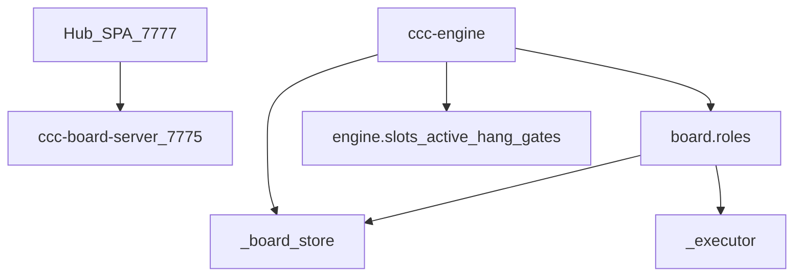

# CCC 核心架构（Engine / Board）

> 维护热点说明。改角色逻辑 → `scripts/board/roles/`；改调度 → `scripts/ccc-engine.py` 或 `scripts/engine/`。

## 职责分层

| 层 | 路径 | 干什么 | 不要在这里 |
|----|------|--------|------------|
| Hub | `scripts/chat_server/` | 对话 / 看板 UI / 运维页 | 角色业务逻辑 |
| Board API | `scripts/ccc-board-server.py` | HTTP 看板 | 长跑调度 |
| **调度面** | `scripts/ccc-engine.py` + `scripts/engine/` | tick、slot、hang、门禁编排 | 新增长角色实现 |
| **角色实现面** | `scripts/board/roles/` | product/dev/reviewer/… | Engine 主循环 |
| 契约/存储 | `_board_store` / `board/phase` / `_config` | JSONL、phases、配置 | UI |
| 兼容入口 | `scripts/ccc-board.py` | CLI + 再导出（兼容 importlib） | **新增长逻辑** |

## 规则

1. **勿在 `ccc-board.py` 新增长角色逻辑** — 下沉到 `board/roles/<role>.py`，由 `ccc-board.py` 再导出。
2. Engine 应 `from board.roles import …` / `from board.phase import …`；整文件 `importlib` 加载 monolith 正在退役。
3. 角色模块只依赖 `board.context` / `store_ops` / `phase` / `roles.common` / `_executor` 等，**禁止** `import ccc_engine`。角色 prompt 注入经 `build_role_context`（见 [`docs/product/context-manifest.md`](product/context-manifest.md)）。
4. Cockpit `:7778` **deprecated** → Hub `#/ops`（见 `docs/hub-ops-console.md`）。
5. Patrol（`ccc-patrol-v4.py`）是**独立运维探针**，不是 Engine 流水线核心。

## 维护热点（刻意写明）

- `ccc-board.py` / 历史巨文件：兼容层，持续变薄。
- `ccc-engine.py`：调度主循环，运行时抽到 `scripts/engine/`。
