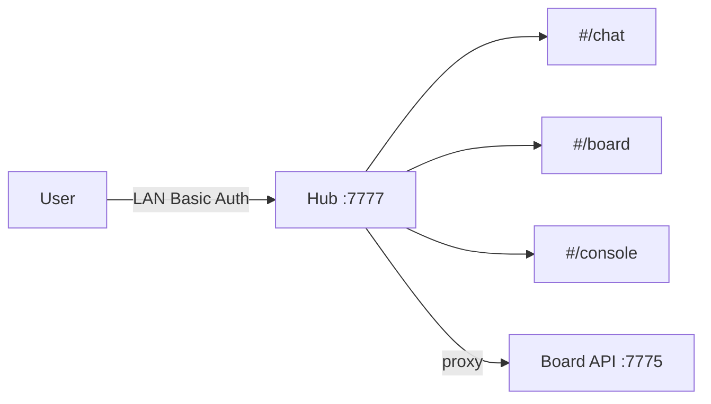

# CCC 前端统一重构方案（Hub `:7777`）

> 状态：**已批准并落地**（D1=A / D2=A / D3=A / D4=A；Hub 端口强制 **7777**）  
> 日期：2026-07-16  
> 视觉基准：`scripts/chat_server/frontend`（Claude 暖色 / Anthropic 风）  
> 端口权威索引：[`ccc-hub-ports.md`](./ccc-hub-ports.md)

---

## 0. 一句话结论

以 **Chat 升格为 CCC Hub**，对外只记 **`:7777`**；Board 退为 **`:7775` API-only**；UI 路由 `#/chat` `#/board` `#/console`，统一暖色 design token。

---

## 1. 现状 → 目标

| 之前 | 之后 |
|------|------|
| Chat 8084 / Board UI+API 7777 / Cockpit 7778 | **Hub 7777**（对话+看板+控制台+运维）+ **Board API 7775** |
| 三套皮肤 | 一套 Claude 暖色 |
| `dashboard.html` 重复 | **已删除**；旧板页 → 重定向 Hub |



---

## 2. 视觉基准

Token 源：`scripts/chat_server/frontend/css/variables.css`  
壳样式：`css/shell.css`  
**禁止** 靛蓝 / GitHub blue / 冷黑作为主色。

---

## 3. 信息架构（已实现）

```
http://<IP>:7777/#/chat
http://<IP>:7777/#/board
http://<IP>:7777/#/console
```

- Hub 同源反代：`/api/board` `/api/tasks` `/api/dashboard` `/api/roles` …
- 任务 seed 仍走：`/api/board/proxy/tasks`（`plan_md` / `phases_jsonl`）
- **账密**：`ccc` / `ccc`（见 [`ccc-hub-ports.md`](./ccc-hub-ports.md)）
- 自检：`python3 scripts/verify-ccc-hub.py`（交付前必须全绿）
- Board 静态页：`ccc-board-ui/index.html` / `board.html` → 跳转 Hub
- Phase 4 `/ops`（Cockpit 合并）：**已做** Hub `#/ops`；Cockpit 深链保留一期后废弃（见 `docs/hub-ops-console.md`）

---

## 4. 阶段完成度

| Phase | 内容 | 状态 |
|-------|------|------|
| 0 | Hub 壳 + hash 路由 + shell.css | ✅ |
| 1 | Hub:7777 / Board:7775 / 反代 | ✅ |
| 2 | 暖色看板 `#/board` | ✅ |
| 3 | 暖色控制台 `#/console` | ✅ |
| Docs | 端口与相关文档梳理 | ✅ [`ccc-hub-ports.md`](./ccc-hub-ports.md) |
| 4 | `/ops` + 废弃 Cockpit | ✅ Hub 运维页已上；Cockpit 迁移说明见 hub-ops-console.md |

---

## 5. 验收

- [ ] 局域网只记：`http://<IP>:7777`
- [ ] 侧栏可进对话 / 看板 / 控制台，风格一致
- [ ] Board API 仅本机 7775；Hub 代理带 Basic Auth
- [ ] 旧 `dashboard.html` 不存在；旧板页跳转 Hub

---

## 6. 历史决策记录

原方案曾写 Hub=8084；用户批准时改为 **Hub=7777**。详见 `ccc-hub-ports.md`。
