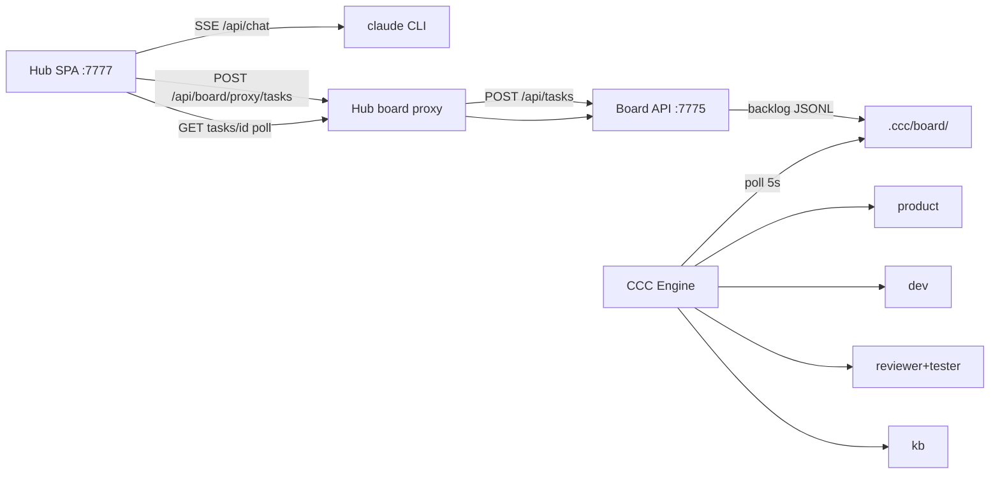

# Chat ↔ CCC 前后端对接方案

> 目标：前端对话可调用 Claude；任务可下达；Engine 自动跑完 product→dev→reviewer→tester→verified。  
> 日期：2026-07-16 | 范围：`scripts/chat_server`（**Hub :7777**）+ Board API `:7775` + Engine  
> 端口权威：[`ccc-hub-ports.md`](./ccc-hub-ports.md)

---

## 1. 目标架构

| 能力 | 路径 | 状态 |
|------|------|------|
| 对话 + 工具 | `POST /api/chat` → claude CLI | ✅ |
| 选项目 | `GET /api/projects` ← Board workspaces | ✅ |
| 下达任务 | `POST /api/board/proxy/tasks` → backlog | ✅ |
| 预置 plan/phases（跳过 product） | body `plan_md` + `phases_jsonl` | ✅ |
| 任务状态 | `GET /api/board/proxy/tasks/{id}` | ✅ |
| 看板摘要轮询 | Board panel 5s + trackDispatchedTask | ✅ |
| 全页看板 / 控制台 | `#/board` `#/console`（Hub 同源） | ✅ |
| Engine 串行流水线 | backlog→…→verified→released | ✅（依赖 upstream :4000） |

---

## 2. 两条下达路径

### A. 完整流水线（默认 UI）

Hub 只写 `title` / `description` / `complexity` → **backlog** → Engine 调 **product** 写 plan+phases → planned → … → verified。

约束（红线）：
- Hub **只写 backlog**
- 不跳过 product（除非显式预置 plan+phases）
- `complexity=small` **不等于** 跳过 product（仅提示）

### B. 预置拆分（Hub / API 加速）

创建时附带 `plan_md` + `phases_jsonl`（见历史 e2e-chat-greet）。Engine 发现齐全 → 直接 backlog→planned。

---

## 3. 服务依赖

| 服务 | 端口 | 必须 |
|------|------|------|
| CCC Hub | **7777** | 是（UI+proxy） |
| Board Server | **7775** | 是（API-only） |
| CCC Engine | launchd | 是 |
| Upstream Anthropic relay | 4000 | product/dev LLM |
| OpenCode / code tier | 4002 | 视 executor |

`CCC_CHAT_USER` / `CCC_CHAT_PASS` 默认为 **`ccc` / `ccc`**（见 `docs/ccc-hub-ports.md`）。

自检：`python3 scripts/verify-ccc-hub.py`

---

## 4. 前端操作闭环

1. `/task` 或标题栏下达 → 写 backlog  
2. 自动打开看板摘要 + `trackDispatchedTask` 轮询列变化  
3. Toast：`backlog → planned → in_progress → testing → verified`  
4. Hub 顶栏「看板」进 `#/board`；「控制台」进 `#/console`

---

## 5. 验收标准（对接完成定义）

- [x] Hub 能 SSE 对话并出 tool_use  
- [x] 创建任务后 Board `GET /api/tasks/<id>` 可见且在 backlog  
- [x] Engine ≤10s 内开始处理（planned 或 product 日志）  
- [x] 预置 plan 任务能到达 **verified**（或 tester PASS）  
- [x] UI 跟踪 toast 与看板摘要同步  
- [x] 局域网入口统一为 `:7777`

---

## 6. 已知限制 / 后续

- Cockpit `:7778` → Hub `/ops` 尚未做（Phase 4）
- 旧书签 `:8084` 需改到 `:7777`
