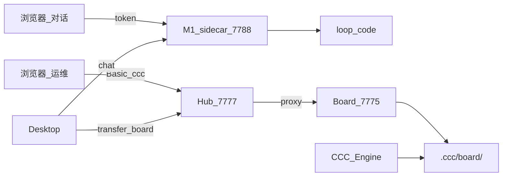

# CCC Hub 端口 · 账密 · 运维（权威）

> 更新日期：2026-07-21（双口纠偏）  
> **编排口**：`http://<Mac2017>:7777`（看板 / 运维 / transfer API）  
> **对话口**：`http://<M1>:7788`（sidecar；见 [`product/hub-remote-management.md`](product/hub-remote-management.md)）  
> Hub 账密：**用户名 `ccc` / 密码 `ccc`**

---

## 1. 一句话

**两个口**：聊对齐/聊方案打 **M1 `:7788`**；看板与运维打 **Hub `:7777`**（`#/board`、`#/ops`、`#/console`）。  
Board 进程只在编排机本机 **`:7775`** 提供 API，由 Hub 反代。  
**不要**再宣传「浏览器只记 `:7777` 含聊天」。

---

## 2. 端口

| 端口 | 服务 | 机器 | 说明 |
|------|------|------|------|
| **7788** | Agent Sidecar | **M1** | 对话热路径（Desktop + 远程聊） |
| **7777** | **CCC Hub** | **Mac2017** | 编排 UI + Board 反代 + Desktop API |
| **7775** | Board API | Mac2017 本机 | 仅本机；勿对局域网直接开 |
| 7776 | Engine stats（若启用） | 本机 | 与 Hub 无关 |
| 7778 | Cockpit（可选） | 本机 | 旧总控；外链已指向 Hub |
| ~~8084~~ | 废弃 | — | 旧 Chat；不应再监听 |
| ~~18084~~ | 测试临时口 | — | pytest 残留应杀掉 |

### 现网 URL

```
# 对话（M1）
http://192.168.3.140:7788/health

# 编排（Mac2017 Hub）
http://192.168.3.116:7777/#/board
http://192.168.3.116:7777/#/ops
http://192.168.3.116:7777/#/console
```

（`#/chat` 挂在 Hub 上会**跳转** M1 对话口，不是产品聊入口。）

### 安全备注

- Sidecar `:7788` 默认可 LAN 访问（`CCC_AGENT_HOST=0.0.0.0`），**仅内网**；须持 `~/.ccc/agent-token`。
- Hub CORS 默认允许内网 Origin（M1 SPA → 2017 API）。勿在 plist 把 `CCC_CHAT_CORS_ORIGIN_REGEX` 缩回仅 localhost，否则双口 SPA 下达失败。
- 遗留 Agent 反代：仅 `CCC_AGENT_PROXY=1` 时挂载 `/api/agent/*`。

---

## 3. 账密

| 项 | 值 |
|----|-----|
| 用户名 | `ccc`（`CCC_CHAT_USER`） |
| 密码 | `ccc`（`CCC_CHAT_PASS`） |

- 仓库 plist `scripts/com.ccc.chat-server.plist` 已写入上述默认值。
- 前端会清掉旧长口令缓存（`ccc_hub_auth_v2`）；若浏览器仍 401，清 `localStorage` 的 `ccc_chat_pass` 后刷新。
- 禁止口令：空、`claude2026`、`password`、`admin`、`123456`、`changeme`。

---

## 4. 环境变量

| 变量 | 默认 | 说明 |
|------|------|------|
| `CCC_CHAT_PORT` | `7777` | Hub |
| `CCC_CHAT_HOST` | `0.0.0.0` | LAN |
| `CCC_CHAT_USER` | `ccc` | Basic Auth 用户 |
| `CCC_CHAT_PASS` | `ccc` | Basic Auth 密码 |
| `CCC_CHAT_IDLE_TIMEOUT` | `600` | 对话空闲超时（秒；有输出则重置） |
| `CCC_CHAT_MAX_TIMEOUT` | `1800` | 单轮对话硬上限（秒） |
| `CCC_BOARD_URL` | `http://127.0.0.1:7775` | Hub→Board |
| `BOARD_PORT` | `7775` | Board API |
| `BOARD_HOST` | `127.0.0.1` | Board 仅本机 |

---

## 5. 开发 vs 常驻（重要）

**改前端 / 调 Hub UI — 只用前台，不要装 launchd：**

```bash
bash scripts/ccc-hub-dev.sh          # Board:7775 + Hub:7777，Ctrl-C 即停
bash scripts/ccc-hub-dev.sh stop
python3 scripts/verify-ccc-hub.py    # 自检（需先 hub-dev）
```

`ccc-hub-dev.sh` **不改** `control.json`、**不装** KeepAlive、**不启** Engine。

**需要开机常驻 UI（仍无 Engine）：**

```bash
bash scripts/install-board-plist.sh   # 仅 stage
bash scripts/install-hub-plist.sh     # 仅 stage
bash scripts/ccc-autostart-guard.sh ui --start
```

**全流水线（Engine）：**

```bash
bash scripts/ccc-autostart-guard.sh enable --start
```

**停一切常驻：**

```bash
bash scripts/ccc-autostart-guard.sh disable
```

> 禁止再把「打开还是旧皮」的修复写成无脑 `install-*-plist.sh` 并 load——那会 KeepAlive 复活后台。

日志（常驻时）：
- Hub：`/tmp/ccc-chat-server.log` / `.err`
- Board：`~/.ccc/logs/ccc-board.{out,err}.log`
- 前台开发：`~/.ccc/logs/hub-dev-*.log`

---

## 6. 架构（双口）



旧 `ccc-board-ui/index.html`、`board.html` 仅重定向到 Hub；`dashboard.html` 已删除。  
Hub **不做**产品聊天 runtime（见 [`product/hub-remote-management.md`](product/hub-remote-management.md)）。

---

## 7. 相关文档

| 文档 | 内容 |
|------|------|
| 本文 | 端口 / 账密 / 运维权威 |
| `ccc-frontend-unification-plan.md` | 前端统一方案（已落地） |
| `chat-ccc-integration.md` | Chat↔Board↔Engine 对接 |
| `.ccc/infrastructure.md` | 机器总览（含 Hub 行） |

---

## 10. 对话列表：清理测试 + Claude 历史

### 清理测试对话
- 侧栏「清理」按钮，或 `POST /api/history/cleanup-tests?project=ccc`
- 会把 `ch*/sc*/sp*/ex*/ss*` 及常见 e2e 标题移到 `.ccc/chat/_trash/`
- 测试进程请设 `CCC_CHAT_DIR` 到临时目录，避免再污染

### 对接 Claude Code 历史
- 侧栏来源：`全部` / `Hub` / `Claude`
- Claude 会话来自 `~/.claude/history.jsonl` + `~/.claude/projects/<escaped-cwd>/*.jsonl`
- 点击 Claude 会话可读完整 transcript；继续发消息时走 `claude --resume <uuid>`
- Claude 历史只读展示（不在 Hub 内删除 Claude 本地文件）


常见原因（2026-07-16 已踩）：

1. **launchd 被挪走 / control=disabled**：Hub 未在跑，浏览器仍展示旧缓存。
2. **修复（开发）**：
   ```bash
   bash scripts/ccc-hub-dev.sh
   # 另开终端：
   python3 scripts/verify-ccc-hub.py
   ```
3. **修复（要常驻 UI，仍不要 Engine）**：
   ```bash
   bash scripts/ccc-autostart-guard.sh ui --start
   ```
4. **浏览器**：硬刷新（Cmd+Shift+R）；或清该站缓存后再开 `http://<IP>:7777`（账密 ccc/ccc）。
5. **辨认新 UI**：顶栏有 `CCC Hub` +「对话 / 看板 / 控制台」；暖色纸感。旧皮是冷黑 `#0b1120` / GitHub 深色，已不再由 Board 提供。
6. **归档目录** `.claude/worktrees-archive-*` 里仍有历史 board.html，勿当生产入口打开。
