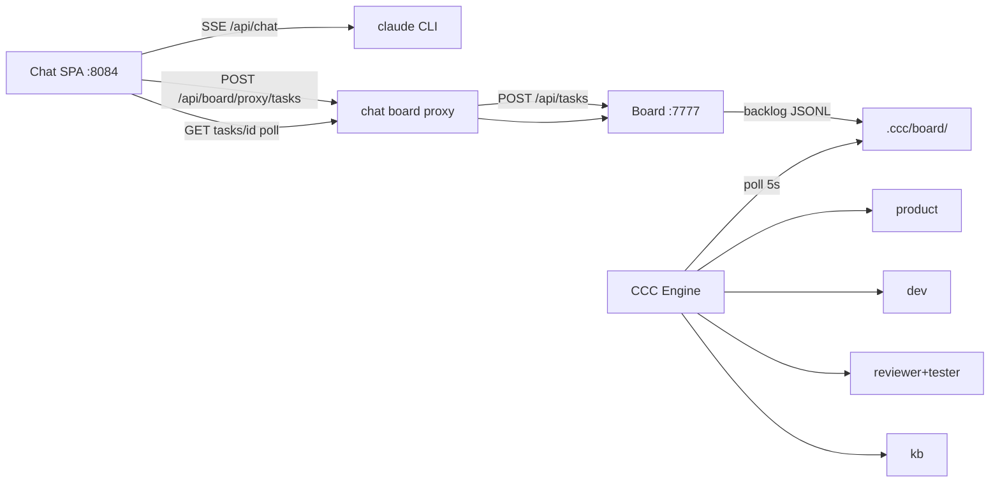

# Chat ↔ CCC 前后端对接方案

> 目标：前端对话可调用 Claude；任务可下达；Engine 自动跑完 product→dev→reviewer→tester→verified。  
> 日期：2026-07-16 | 范围：`scripts/chat_server` + Board `:7777` + Engine

---

## 1. 目标架构



| 能力 | 路径 | 状态 |
|------|------|------|
| 对话 + 工具 | `POST /api/chat` → claude CLI | ✅ |
| 选项目 | `GET /api/projects` ← Board workspaces | ✅ |
| 下达任务 | `POST /api/board/proxy/tasks` → backlog | ✅ |
| 预置 plan/phases（跳过 product） | body `plan_md` + `phases_jsonl` | ✅ |
| 任务状态 | `GET /api/board/proxy/tasks/{id}` | ✅ |
| 看板摘要轮询 | Board panel 5s + trackDispatchedTask | ✅ |
| Engine 串行流水线 | backlog→…→verified→released | ✅（依赖 upstream :4000） |

---

## 2. 两条下达路径

### A. 完整流水线（默认 UI）

Chat 只写 `title` / `description` / `complexity` → **backlog** → Engine 调 **product** 写 plan+phases → planned → … → verified。

约束（红线）：
- Chat **只写 backlog**
- 不跳过 product（除非显式预置 plan+phases）
- `complexity=small` **不等于** 跳过 product（仅提示）

### B. 预置拆分（Chat / API 加速）

创建时附带：

```json
{
  "id": "e2e-chat-greet",
  "title": "...",
  "workspace": "CCC",
  "plan_md": "# Plan: ...",
  "phases_jsonl": "{\"schema_version\":\"1.1\"}\n{\"phase\":1,...}\n"
}
```

Engine 发现 plan+phases 齐全 → **直接 backlog→planned**，跳过 product，仍走 dev→reviewer→tester。

---

## 3. 服务依赖

| 服务 | 端口 | 必须 |
|------|------|------|
| Chat Server | 8084 | 是（UI+proxy） |
| Board Server | 7777 | 是 |
| CCC Engine | launchd | 是 |
| Upstream Anthropic relay | 4000 | product/dev LLM |
| OpenCode / code tier | 4002 | 视 executor |

`CCC_CHAT_PASS` 必须在 LaunchAgents 配置（勿写入仓库 plist）。

---

## 4. 前端操作闭环

1. `/task` 或标题栏下达 → 写 backlog  
2. 自动打开看板摘要 + `trackDispatchedTask` 轮询列变化  
3. Toast：`backlog → planned → in_progress → testing → verified`  
4. `/board` 看列计数；完整看板外链 `:7777`

---

## 5. 验收标准（对接完成定义）

- [ ] Chat 能 SSE 对话并出 tool_use  
- [ ] Chat 创建任务后 Board `GET /api/tasks/<id>` 可见且在 backlog  
- [ ] Engine ≤10s 内开始处理（planned 或 product 日志）  
- [ ] 预置 plan 任务能到达 **verified**（或 tester PASS）  
- [ ] UI 跟踪 toast 与看板摘要同步  

---

## 6. 已知限制 / 后续

| 项 | 说明 |
|----|------|
| product 耗时长 | 依赖 :4000；可用路径 B 预置 plan |
| quick intake | 已修：成功进 **testing** 而非卡在 in_progress |
| 文件树 / Execute | Phase 4，非本对接阻塞 |
| 多 workspace | 必须传 `workspace`；UI 用 `projectWorkspaceMap` |

---

## 7. E2E 样例任务（2026-07-16 实测）

**任务** `e2e-chat-greet`（经 Chat `POST /api/board/proxy/tasks` + `plan_md`/`phases_jsonl`）

| 步骤 | 结果 |
|------|------|
| 创建 backlog + seed plan/phases | ✅ HTTP 201，`skip_product=true` |
| Engine 跳过 product → planned → in_progress | ✅ ~5s |
| opencode 写出 `_e2e_greet.py` + 测试 | ✅ phase done，commit `c8e88ac` |
| testing 门禁 | ⚠️ 首次 reviewer `claude rc=1` → FALLBACK → abnormal（upstream 抖动） |
| 修复 `complexity` 持久化 + 设 small | ✅ F-FLOW-02 门禁跳过 → **verified** |
| pytest | ✅ `tests/scripts/test_e2e_greet.py` 2 passed |

**对接缺陷已修**：`FileBoardStore.create_task` 原先写盘丢弃 `complexity`，导致 Chat 传 `small` 无效、误走 medium LLM 门禁。

---

## 8. 已知限制 / 后续

| 项 | 说明 |
|----|------|
| product 耗时长 | 依赖 :4000；可用路径 B 预置 plan |
| reviewer FALLBACK | upstream 瞬时失败会 quarantine；small 可跳过 LLM 门禁 |
| quick intake | 已修：成功进 **testing** 而非卡在 in_progress |
| 文件树 / Execute | Phase 4，非本对接阻塞 |
| 多 workspace | 必须传 `workspace`；UI 用 `projectWorkspaceMap` |